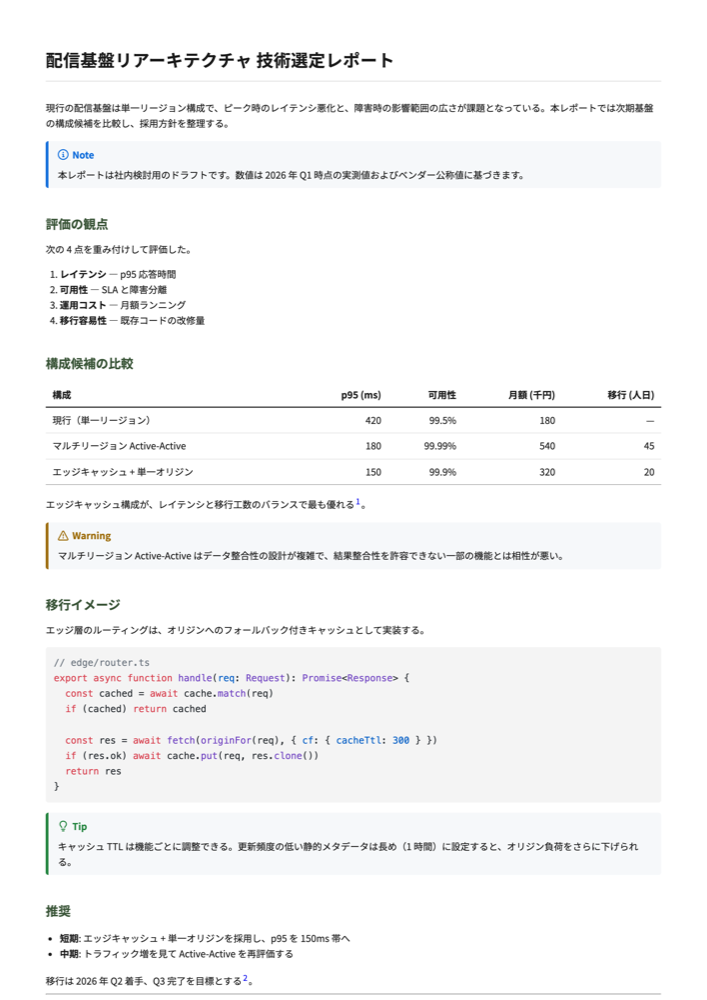
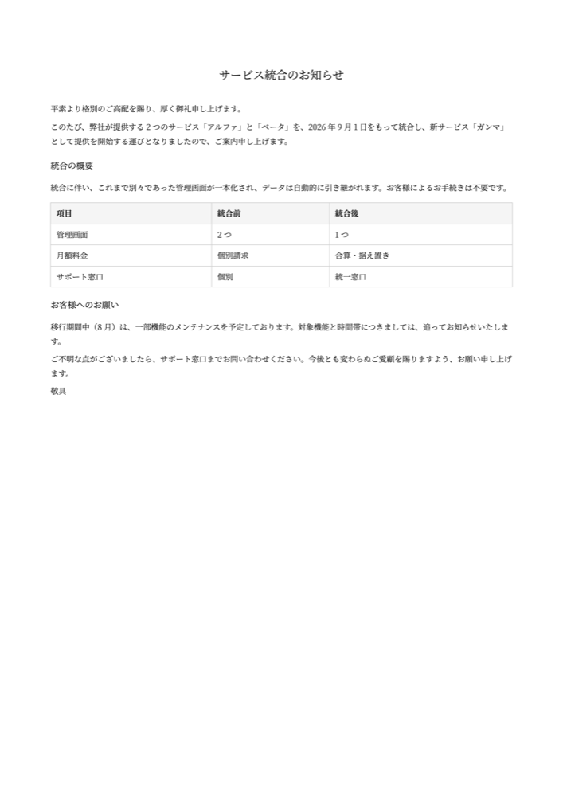
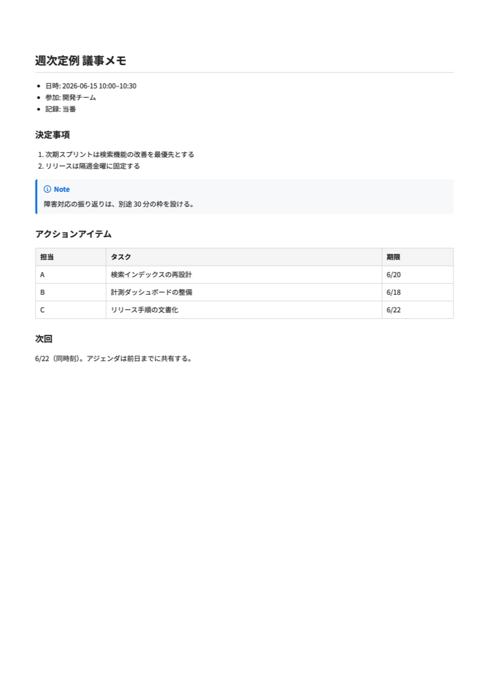

> 🇯🇵 [日本語](./README.md)

# @hayashiii/pdfmint

[](https://www.npmjs.com/package/@hayashiii/pdfmint)
[](https://www.npmjs.com/package/@hayashiii/pdfmint)
[](https://opensource.org/licenses/MIT)
[](https://nodejs.org)

**AI-agent-first** CLI for converting HTML/Markdown to clean Japanese PDFs. Designed to turn agent-generated drafts into shareable PDF/PNG deliverables with one command.

- 📄 Outputs are plain PDF files plus optional PNG files (no database required)
- 🤖 One-command workflow for AI agents such as Claude Code and Codex (Claude Code Skill bundled)
- 📡 Structured output via `--json` so agents can parse conversion results
- ⚙️ Structured errors (`code` + `hint`) and `--expect-pages` make retries and quality checks easier
- 📝 Supports HTML, Markdown, and batch conversion for agent-generated document sets
- ✍️ Markdown supports GFM plus **frontmatter stripping, footnotes, GitHub callouts, and syntax highlighting**
- 🎨 Beautiful Japanese rendering (Noto Sans JP first; Noto Serif JP selectable)
- 🔧 TypeScript implementation with Bun for development and Node.js 22+ for distribution

---

## Examples

Real output from the three presets. Each image links to its source Markdown and PDF ([`examples/`](./examples)).

| report | letter | memo |
|:---:|:---:|:---:|
| [](./examples/report.pdf) | [](./examples/letter.pdf) | [](./examples/memo.pdf) |
| Technical report (`--preset report`)<br>tables, code, callouts, footnotes | Formal letter (`--preset letter`)<br>serif, centered title | Meeting memo (`--preset memo`)<br>simple business doc |

Sources: [report.md](./examples/report.md) · [letter.md](./examples/letter.md) · [memo.md](./examples/memo.md)

```bash
pdfmint examples/report.md report.pdf --preset report
```

---

## Install

```bash
npm install -g @hayashiii/pdfmint
# or
bun install -g @hayashiii/pdfmint
```

Requires **Node.js 22+**.

## Quick Start

```bash
# Single file
pdfmint invoice.html invoice.pdf

# Markdown → PDF
pdfmint resume.md resume.pdf

# Markdown → PDF with serif Japanese preset
pdfmint report.md report.pdf --font serif

# Markdown → PDF with fixed CSS
pdfmint report.md report.pdf --css report.css

# Generate PDF + high-resolution PNG together
pdfmint report.html report.pdf --png report.png --viewport 1055x1491 --scale 3

# Batch
pdfmint batch "./html/*.html" ./pdf/

# JSON output (AI agent friendly)
pdfmint invoice.html invoice.pdf --json
```

## Commands

| Command | Purpose |
|---|---|
| `pdfmint <input> <output>` | Convert single HTML/Markdown to PDF |
| `pdfmint batch <pattern> <out-dir>` | Batch processing |
| `pdfmint help` | Help |
| `pdfmint --version` | Version |

### Flags

| Flag | Default | Description |
|---|---|---|
| `--json` | off | JSON output |
| `--format <size>` | A4 | Paper size (A4 / A3 / Letter / Legal) |
| `--margin <value>` | 0 | Margin |
| `--landscape` | off | Landscape orientation |
| `--no-background` | off | Disable CSS backgrounds |
| `--font <sans\|serif>` | sans | Japanese font preset for Markdown input |
| `--css <file.css>` | off | Custom CSS file for Markdown input |
| `--brand <file.md>` | auto-discovery | Brand profile file (consistent look across documents) |
| `--no-brand` | off | Disable brand profile auto-discovery |
| `--png <output.png>` | off | Also render a PNG from the same input |
| `--viewport <WxH>` | 1055x1491 | PNG viewport size |
| `--scale <number>` | 3 | PNG device scale factor |
| `--expect-pages <number>` | off | Fail when generated PDF page count differs |

## JSON Output Example

```json
{
  "success": true,
  "input": "/abs/invoice.html",
  "output": "/abs/invoice.pdf",
  "format": "A4",
  "size_bytes": 4827410,
  "page_count": 1,
  "duration_ms": 1234
}
```

When generating PDF and PNG together:

```json
{
  "success": true,
  "input": "/abs/report.html",
  "output": "/abs/report.pdf",
  "format": "A4",
  "size_bytes": 920701,
  "duration_ms": 3042,
  "page_count": 1,
  "png": {
    "output": "/abs/report.png",
    "width": 3165,
    "height": 4473,
    "size_bytes": 10078027
  }
}
```

## Supported Markdown syntax

In addition to GFM (tables, task lists, strikethrough, autolinks), the following are supported, and work with every preset, the default CSS, and `--css`:

- **Frontmatter**: a leading `--- ... ---` block is stripped from the body (never leaks into output). `title:` becomes the document title (`<title>`). Other keys are ignored here (the consistent look is configured separately via `brand.md`).
- **Footnotes**: `text[^1]` + `[^1]: note` renders a superscript reference plus a footnotes section at the end of the document, with back-references.
- **Callouts (GitHub alerts)**: `> [!NOTE]` / `[!TIP]` / `[!IMPORTANT]` / `[!WARNING]` / `[!CAUTION]` become colored, titled admonition blocks.
- **Syntax highlighting**: fenced code blocks are highlighted with highlight.js (GitHub-light theme). The language hint (` ```ts `) selects the grammar; unknown/no language falls back to plain escaped text.

## Brand profile

Define your look (colors, font, spacing, paper) once in a `brand.md` and it applies to every Markdown conversion automatically — no per-document flags. Auto-discovered from `./pdfmint.brand.md` (project), then `~/.config/pdfmint/brand.md` (global).

```markdown
---
accent: "#1B365D"      # heading rule / blockquote accent
ink: "#1a1a1a"         # body and heading text color
font: serif            # sans | serif
font_size: 10.5pt
line_height: 1.65
paper: A4              # A4 | A3 | Letter | Legal
margin: 18mm
---
Free notes below the frontmatter are ignored by the renderer.
```

- Precedence: explicit CLI flag (`--font` / `--format` / `--margin`) > brand token > built-in default
- `--brand <file.md>` to pick a profile explicitly, `--no-brand` to disable
- The `--json` result reports which profile was applied via the `brand` field

---

## Notes

- **Images and fonts**: use absolute paths or `data:` URLs in HTML — Puppeteer's `file://` resolution may not behave as expected for relative paths.
- **Margins**: for Markdown input, `--margin` (flag > brand `margin` token > preset default) applies to both the PDF and the PNG with the same value (internally the `@page` rule and the screen padding share one `--pm-margin` variable). Values must be a length with unit (e.g. `18mm` / `1in`) or `0`. For HTML input, the HTML's own `@page` rule wins; `--margin` only applies when `@page` declares no margin.
- **Single-page reports**: pass `--expect-pages 1` to catch accidental second pages.
- **Image deliverables**: use `--png` with `--viewport` / `--scale` to produce a shareable PNG and printable PDF from the same HTML.
- **Japanese fonts**: Markdown input defaults to `--font sans`, prioritizing Noto Sans JP. Use `--font serif` to prioritize Noto Serif JP. Use `--css report.css` when you need fixed typography, margins, and heading styles for deliverables. For HTML input, set fonts in your own `<style>`.
- **AI agent integration**: always pass `--json` (progress logs go to stderr, the result JSON goes to stdout).

---

## License

MIT © 2026 Hayashi

---

## Links

- [GitHub repository](https://github.com/hayashiii-ghub/pdfmint)
- [Issues](https://github.com/hayashiii-ghub/pdfmint/issues)
- [npm](https://www.npmjs.com/package/@hayashiii/pdfmint)
- [AGENTS.md](./AGENTS.md) — AI agent guide
- [CHANGELOG](./CHANGELOG.md)
